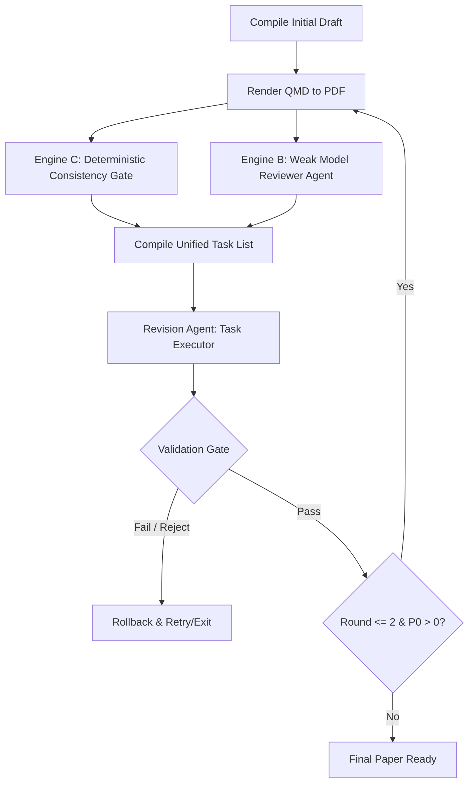

# Review-Revision Loop Architecture and Task-List Design

This document details the concrete, opinionated design and architecture for the paper review-revision iteration loop. It addresses the unreliability of the weak model (`big-pickle` / Zen shim) on `ac-2012` and establishes a structured, schema-driven path to guarantee convergence without regression.

---

## 1. Recommended Architecture: The Dual-Engine Reviewer

Given that `ac-2012` is completely offline/air-gapped and lacks credentials for strong models (no Copilot, no Codex, no Gemini/Agy, and `sk-noauth` is fake), **Option A (Cross-CLI Reviewer) is disqualified**. Relying on an external SSH connection back to a Mac host introduces a severe out-of-band dependency that violates the self-contained container contract.

Instead, we recommend a **Unified Hybrid Architecture (Combination of B and C)**:



### Why this Unified Hybrid Architecture?
- **Engine C (Deterministic consistency gate)** mechanically extracts experimental ground-truth numbers from `real_results.json` and scans `paper_draft_v0.qmd` via regex. If the paper claims a temporal split but the dataset contains only 2016, or if the number of classifiers in prose doesn't match the experiment, Engine C emits a hard **P0 task** with 100% reliability. This completely eliminates the "false pass" risk where a weak model overlooks a major logical contradiction.
- **Engine B (Weak model reviewer)** is freed from numerical and logical validation. It is prompted to look only for qualitative writing flaws (e.g., missing sections, formatting alignment, flow) and output them in the exact same task schema.
- **Cognitive Load Reduction**: By presenting the revision step with a concrete list of tasks rather than vague complaints, the weak model's generation quality remains extremely high. We confirmed that when given explicit instructions, the rewrite step works perfectly.

---

## 2. Standardized Task-List Schema

To bridge Engine C and Engine B, both must output a unified task list. The revision driver parses this list, executes edits sequentially, and runs corresponding validation checks.

```json
{
  "tasks": [
    {
      "id": "DET-G2-001",
      "severity": "P0",
      "type": "find_replace",
      "target_section": "### 3.3 Evaluation Protocol",
      "target_content": "training on 2014–2018 applications, evaluating on 2020 applications",
      "replacement_content": "nested 5-fold cross-validation on the 2016 cohort",
      "description": "Temporal train/test split is logically impossible because HUPD cohort is restricted to filing year 2016.",
      "verification": {
        "method": "assert_substring_absent",
        "payload": {
          "absent_substring": "2014–2018",
          "present_substring": "5-fold"
        }
      }
    }
  ]
}
```

### Schema Field Definitions:
- **`id`**: Unique identifier (e.g., `DET-G2-001` for deterministic, `LLM-G1-002` for model).
- **`severity`**: `"P0"` (blocking / desk reject) or `"P1"` (style / formatting).
- **`type`**: `"find_replace"` (sub-string edit) or `"section_rewrite"` (entire section replacement).
- **`target_section`**: Markdown header to locate the context.
- **`target_content`**: The exact substring expected in the file.
- **`replacement_content`**: The concrete text to write.
- **`description`**: Explanatory rationale.
- **`verification`**: The check configuration containing `method` (e.g. `assert_substring_absent`) and its `payload`.

---

## 3. Convergence and Regression Guardrails

Weak models are notoriously prone to fixing one bug while breaking formatting or word counts. We enforce three strict guardrails:

1. **Find-and-Replace Editor (No Full-File Rewrites)**: Instead of asking the model to rewrite the whole file, the Python driver uses the task list to run targeted, line-bounded edits. For qualitative tasks, the model is only allowed to edit the specific block matching `target_content`.
2. **Post-Revision Validation Gate**: Every revision round must pass:
   - [mechanical_check.py](file:///Users/user/projects/ai-paper-workshop/papers/_experiments/repro-bench-2026-06/mechanical_check.py) (verifies word count >3000, citations >=35, no empty table cells).
   - [verify_matrix.py](file:///Users/user/projects/ai-paper-workshop/papers/_experiments/repro-bench-2026-06/verify_matrix.py) (verifies required artifacts exist).
   - **ReportLab Render Check**: The paper must compile without error, producing a PDF >1000 bytes.
3. **Automated Rollback**: If a revision fails any of the gate checks or if the overall score degrades, the driver rolls back the `.qmd` file to the pre-round state (using cached files under `history_round_{idx}/`) and aborts the loop, keeping the best-known version.

---

## 4. Highest-Leverage First Step

The single highest-leverage thing to build first is **Engine C: The Deterministic Consistency Gate** (`mechanical_consistency.py`). 

It is 100% reliable, runs in milliseconds, requires zero API usage, and immediately blocks the critical failure mode (the impossible temporal split) that currently causes false passes. It will serve as a bulletproof sanity check that guarantees the ground truth in `real_results.json` matches the text.

---

## 5. Hidden Failure Modes

1. **Hallucinated Target Substrings**: The weak model reviewer (Engine B) may describe a text block in `target_content` that doesn't exist verbatim in the `.qmd` (e.g., minor typo or spacing differences).
   - *Mitigation*: The python driver must validate `target_content` matches in the `.qmd` *before* starting the revision. If it fails, fall back to matching the closest line or replacing the parent section.
2. **ReportLab Control Code Injections**: The weak model might attempt to solve a formatting task by injecting raw HTML or custom ReportLab flowables that crash the template engine.
   - *Mitigation*: Strictly sanitize the replacement string to strip XML/HTML tags unless they are explicitly permitted styling tags (like `<i>` or `<b>`).
3. **Loss of Citation Context**: While rewriting a paragraph, the weak model may fail to carry over the BibTeX citation keys (e.g. `[@Lanjouw2004]`), which drops the citation count below 35 and triggers a failure.
   - *Mitigation*: Programmatically scan the pre-edited block for citation keys, and verify that the same keys (or a valid subset) exist in the replacement block.
