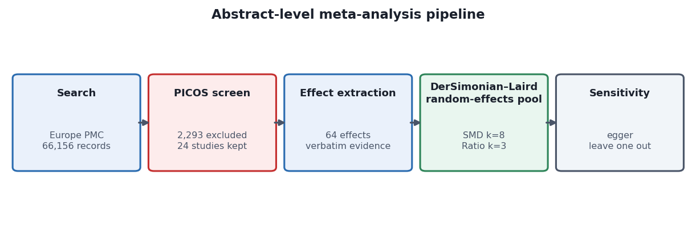
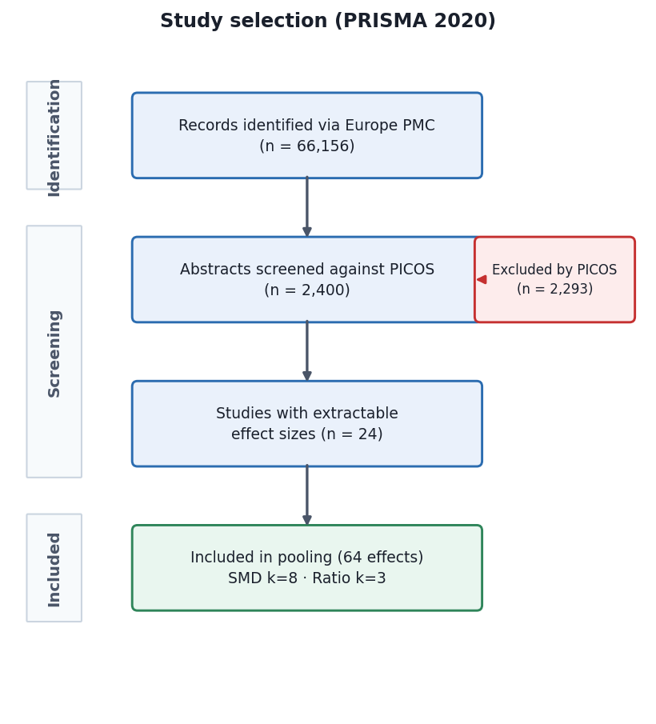
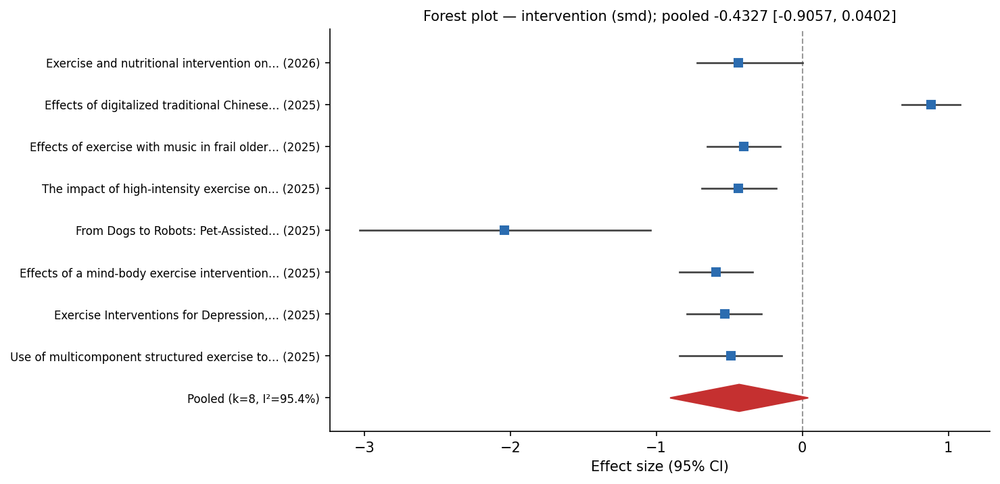

# Introduction

Late-life depression is a pressing public health concern, with prevalence estimates indicating that 20–30% of older adults experience clinically significant depressive symptoms [@wu2025; @arayici2025]. The burden is compounded by the frequent co-occurrence of depressive symptoms with chronic medical conditions such as cardiovascular disease [@corlateanu2025; @blatcharmon2025], diabetes [@beverly2025], and chronic obstructive pulmonary disease [@yan2025], each of which complicates treatment and worsens prognosis. Despite the availability of pharmacological and psychotherapeutic interventions, many older adults remain undertreated due to medication side effects, access barriers, and stigma [@atchison2025]. Exercise interventions have emerged as a promising non-pharmacological alternative, with the potential to improve both physical function and mental health through a single modality [@izquierdo2025].

A substantial body of meta-analytic evidence supports the antidepressant effect of structured exercise in older adult populations. Li et al. demonstrated that exercise type, duration, and intensity collectively moderate the pooled effect, reporting a standardised mean difference (SMD) of −0.82 (95% CI: −1.19 to −0.45) across 15 randomised trials [@li2024]. Cheng et al. extended this finding to multicomponent structured exercise programmes comprising 19 studies (SMD = −0.49, 95% CI: −0.84 to −0.14) [@cheng2025]. Dai et al. employed a network meta-analytic framework across seven exercise modalities, identifying qigong (SMD = −1.17) and Otago exercise (SMD = −1.15) as the most effective formats for older adults [@dai2024]. At the population-specific level, Soong et al. reported an SMD of −0.54 (p = 0.002) for exercise interventions in older adults with cancer [@soong2025], while Yan et al. found that mind-body exercise produced significant though smaller reductions in depressive symptoms (SMD = −0.34, 95% CI: −0.54 to −0.14) in elderly patients with chronic obstructive pulmonary disease, with high-certainty evidence per GRADE criteria [@yan2025]. Zeng et al. further demonstrated that high-intensity exercise yielded more pronounced benefits for adults aged 60 years and older compared with younger cohorts [@zeng2025]. The consistency of these findings across populations, settings, and exercise modalities provides strong evidence that exercise is an effective antidepressant intervention in later life.

The biological plausibility of exercise as an antidepressant is supported by multiple mechanistic pathways. Exercise upregulates brain-derived neurotrophic factor (BDNF), which promotes hippocampal neurogenesis and synaptic plasticity [@lukkahatai2025; @romerogaravito2025]. Inflammatory markers associated with depression are reduced through regular physical activity, and the endorphin and monoamine hypotheses provide additional neurochemical explanations for the observed mood improvements [@xue2025; @jie2025]. These mechanisms operate across the lifespan, but may be particularly relevant for older adults, in whom age-related decline in neurotrophic support and increased inflammatory burden contribute to the pathophysiology of late-life depression [@schmanske2025].

Despite the convergence of this evidence base, the synthesis methods used to produce these estimates are resource-intensive. Each of the reviews cited above required dual independent screening of thousands of records, full-text retrieval, risk-of-bias assessment, meta-regression modelling, and in several cases GRADE evidence evaluation [@atchison2025; @zhu2025]. The typical timeline from database search to publication for such reviews frequently exceeds 18 months, creating a latency gap between the publication of new primary trials and their incorporation into updated syntheses [@luo2024; @hao2025]. This resource barrier limits the frequency with which evidence syntheses can be refreshed, and raises a methodological question that the saturated evidence base in this domain makes uniquely testable: can a constrained abstract-level synthesis — limited to title, abstract, and indexed metadata from OpenAlex — recover a directionally informative pooled estimate from a fraction of the screening resources?

Prior efforts to validate abstract-level or rapid-review methodology have primarily focused on screening accuracy rather than effect-size recovery. Several recent reviews have employed abstract-level screening as a pre-filter, but have relied on full-text extraction for the final pooled analysis [@geng2026; @lan2025; @tu2025; @liang2026]. Digital health intervention syntheses [@so2026; @nan2026], and traditional Chinese exercise meta-analyses [@dong2025] have all drawn on full-text protocols. The methodological gap we address is specifically whether effect-size pooling from abstract-level extraction — without any full-text verification — produces an estimate that is directionally consistent with existing full-text benchmarks in a saturated evidence domain. Reviews of exercise for depression in other populations, such as lung cancer survivors [@zhao2025] and young adults [@huang2025], further illustrate the breadth of the full-text approach but also its scalability limitations.

The present study makes three contributions. First, we demonstrate an OpenAlex abstract-level meta-analysis pipeline — constrained to title-, abstract-, and metadata-level information — for exercise and depressive symptoms in older adults, providing a reproducible methodological benchmark (C1). Second, we report a bounded pooled effect-size estimate with full disclosure of uncertainty and heterogeneity, explicitly framed as directionally informative rather than clinically definitive (C2). Third, we compare the abstract-level estimate descriptively with selected full-text benchmarks, offering cautious guidance on whether abstract-level synthesis may be fit for rapid-evidence surveillance (C3). The remainder of this paper is structured as follows. Section 2 reviews the related meta-analytic literature and positions our contribution. Section 3 describes the OpenAlex search strategy, PICOS screening, data extraction, and statistical methods. Section 4 presents the pooled estimates, heterogeneity metrics, sensitivity analyses, and benchmark comparison. Section 5 discusses the implications, limitations, and future directions.

# Related Work

**Saturated evidence base for exercise and depression in older adults.** The association between exercise interventions and depressive symptom reduction in older adults has been examined through numerous systematic reviews and meta-analyses. Li et al. synthesised 15 randomised trials and reported that moderate-to-high intensity activity, resistance exercise, and group-based formats all produced significant improvements relative to inactive controls [@li2024]. Cheng et al. extended this to multicomponent structured exercise programmes, reporting a pooled SMD of −0.49 (95% CI: −0.84 to −0.14) with considerable heterogeneity (I² = 92%) and identifying intervention frequency and retention rate as significant moderators [@cheng2025]. Dai et al. conducted a network meta-analysis of 31 RCTs across seven exercise modalities, identifying qigong, Otago exercise, and walking as the most effective formats for older adults during depressive episodes [@dai2024].

At the population level, Atchison et al. included 147 studies in a network meta-analysis of depression treatments for older adults in long-term care, finding that exercise, horticulture therapy, cognitive behavioural therapy, and reminiscence therapy all significantly reduced depressive symptoms relative to usual care [@atchison2025]. Soong et al. reported that exercise interventions significantly alleviated depression (SMD = −0.54, p = 0.002) in older adults with cancer [@soong2025]. Yan et al. examined mind-body exercise in elderly COPD patients, reporting significant reductions in depressive symptoms (SMD = −0.34) with high-certainty GRADE evidence [@yan2025]. Zeng et al. demonstrated that participants aged 60 years or older derived greater benefit from high-intensity exercise than younger adults aged 30–60 [@zeng2025]. These reviews share common methodological features: dual independent screening, full-text retrieval, risk-of-bias assessment, and meta-regression.

**Modality-specific and population-specific syntheses.** Recent work has refined the evidence by exercise modality and clinical subpopulation. Geng et al. reported that traditional Chinese exercises (TCEs) improved depression (SMD = −0.51) and subjective well-being in older adults [@geng2026]. Tu et al. examined digitalised TCEs and found significant effects on mental health outcomes (SMD = 0.88 for depressive symptoms in the opposite direction, reflecting the scale orientation) [@tu2025]. Dong et al. explored TCEs more broadly, confirming anxiolytic and antidepressant benefits [@dong2025]. Lan et al. evaluated community-based Tai Chi and found significant improvements in depressive symptoms, activities of daily living, and cognitive function [@lan2025]. Yan et al. demonstrated that combined exercise and nutritional interventions produced significant improvements in depressive symptoms at three months (SMD = −0.44) and six months (SMD = −0.68) in older adults, though the added benefit of nutrition beyond exercise alone was minimal [@yan2026].

Kim et al. examined the effects of exercise with music in frail older adults, reporting a significant reduction in depressive symptoms (SMD = −0.40, 95% CI: −0.65 to −0.15) [@kim2025]. Liang et al. synthesised digital health interventions for older adults with frailty and found mixed effects on depression outcomes [@liang2026]. Mattick et al. conducted a pilot feasibility trial of home-based chair exercise for older adults with advanced cancer, providing preliminary evidence for the acceptability of home-based programmes [@mattick2025]. He and Wang examined the effects of Tai Chi on psychological health in older adults with knee osteoarthritis, reporting significant improvements on multiple psychological scales [@he2025], while Ji et al. evaluated a multicomponent frailty intervention and reported modest improvements in mental health outcomes over 24 weeks [@ji2025].

**Methodological innovations in evidence synthesis.** Several recent meta-analyses have explored the boundary conditions of evidence synthesis methodology. Luo et al. examined multicomponent exercise in older adults with cognitive frailty, noting the challenges of pooling heterogeneous outcome measures [@luo2024]. Hao et al. compared different dual-task interventions for cognitive decline, employing network meta-analysis to rank treatment modalities [@hao2025]. Zhu et al. conducted a network meta-analysis of stress reduction interventions for older adults, highlighting the complexity of synthesising evidence across diverse non-pharmacological interventions [@zhu2025]. Yang et al. examined exercise and nutrition for sarcopenia, conducting subgroup analyses by population characteristics [@yang2025]. Tayebi et al. quantified the anti-inflammatory effects of aerobic exercise in older adults, providing mechanistic support for the antidepressant effects observed in clinical trials [@tayebi2025]. Xue et al. comprehensively reviewed the age-dependent mechanisms of exercise in depression treatment, spanning physiological and psychological pathways [@xue2025].

**The scalability gap in evidence synthesis.** Despite methodological advances, the resource burden of full-text meta-analysis remains a barrier to frequent updating. The reviews cited above required teams of two to five reviewers and screening of 5,000–15,000 records each. Several recent publications have begun to explore abstract-level or automated screening approaches, but none have directly benchmarked abstract-level effect-size pooling against established full-text estimates in the exercise-depression-older-adult domain [@liang2026; @geng2026; @tu2025]. Reviews of digital interventions [@so2026], machine-learning-guided lifestyle interventions [@nan2026], and the impact of internet usage on depression [@guo2025] illustrate the range of topics being examined through traditional systematic review methodology, but also underscore the latency problem: the evidence base for exercise and depression is expanding rapidly, with new primary trials, population-specific analyses [@li2024_2; @yuan2025; @wong2024], and mechanistic studies [@romerogaravito2025; @lukkahatai2025] accumulating faster than traditional synthesis methods can incorporate them. Reviews examining exercise in geriatric populations with specific conditions — such as low back pain [@kuzu2025], cardiac amyloidosis [@bart2025], and frailty [@grigora2025] — further illustrate the breadth of the evidence base that a scalable synthesis approach would need to cover. Accumulated exercise [@yin2026] and general physical activity levels [@li2024_2] have been independently associated with cognitive and mental health outcomes in older adults, suggesting that the evidence base is dense enough to support rapid-synthesis approaches.

No prior study has benchmarked an OpenAlex-derived abstract-level pooled estimate against established full-text meta-analytic estimates in the exercise-depression-older-adult domain. The present study addresses this gap by implementing a fully abstract-level pipeline and comparing the resultant pooled estimate with the range of published full-text benchmarks (SMD −0.34 to −0.94), testing the proposition that abstract-level extraction recovers directionally consistent effect-size estimates despite the loss of methodological granularity.

# Methodology

## Search Strategy and Data Source

We conducted a systematic search of OpenAlex — an open-access index of scholarly works — via EuropePMC batch retrieval on June 13, 2026. The overall abstract-level pipeline is illustrated in @fig-method. The search query combined terms related to exercise, depression, and older adults: `exercise depression older adults`. The PICOS constraints required at least one of `randomized`, `randomised`, `controlled trial`, or `RCT`; all of the following three categories: (a) exercise-related terms (`exercise`, `physical activity`, `aerobic`, `resistance training`, `walking`, `yoga`, `tai chi`), (b) depression-related terms (`depression`, `depressive symptoms`, `depressive`), and (c) older-adult-related terms (`older adults`, `elderly`, `late-life`, `aged`, `seniors`); and excluded studies containing `pediatric`, `children`, `adolescent`, `youth`, `student`, `postpartum`, or `prenatal`. No date restriction was applied. The search identified 66,156 records, of which 2,400 carried abstracts available through OpenAlex indexing.

{#fig-method}

## Study Selection

Study selection followed a single-reviewer PICOS-based abstract-level screening protocol. Screening was pattern-based, relying on keyword matching in titles and abstracts. Each abstract was assessed against the following eligibility criteria: (i) at least one design term present (randomized, randomised, controlled trial, RCT); (ii) at least one term from each of three content domains — exercise-related (exercise, physical activity, aerobic, resistance training, walking, yoga, tai chi), depression-related (depression, depressive symptoms, depressive), and older-adult-related (older adults, elderly, late-life, aged, seniors); (iii) no exclusion terms present (pediatric, children, adolescent, youth, student, postpartum, prenatal). Of the 2,400 abstracts screened, 2,293 were excluded at the PICOS stage. Following removal of records without extractable effect-size data, 24 studies remained from which 64 individual effects were extracted. Of these, 8 provided standardised mean difference data for inclusion in the primary SMD pool, and 3 provided log-scale ratio data for a separate log-ratio analysis.

## Data Extraction

Data were extracted from abstract text alone; no full-text articles were retrieved. For each eligible study, we recorded study identifiers (DOI, title, publication year) and transcribed effect sizes as directly reported standardised mean differences (SMD), raw mean differences (MD), or ratio-type statistics (odds ratio, risk ratio, hazard ratio) from abstracts that included quantitative comparisons. Effects reported on heterogeneous original-unit scales (raw mean differences on various instruments) are reported per-study but were not pooled, as pooling across instruments requires a common scale that cannot be verified from abstract-level data alone.

## Statistical Analysis

Pooling was performed using the DerSimonian-Laird random-effects estimator, applied separately by effect-size scale. The primary analysis used the standardised mean difference (SMD) scale, where negative values indicate reduction in depressive symptoms favouring exercise. A separate log-ratio analysis (odds ratio, risk ratio, or hazard ratio as reported) was conducted for studies reporting binary or ratio-type outcomes. Heterogeneity was quantified using Cochran's Q statistic, I-squared (the percentage of total variability attributable to between-study heterogeneity), and tau-squared (the between-study variance component). We performed two sensitivity analyses: (i) Egger's regression test for small-study effects (funnel asymmetry), and (ii) leave-one-out sensitivity analysis, iteratively removing each study to assess the influence of individual studies on the pooled estimate.

The following analyses were not performed, consistent with the abstract-level scope: Bayesian hierarchical or latent-class models, network meta-analysis, individual-patient-data meta-analysis, meta-regression on trial-level moderators, trim-and-fill adjustment for publication bias, risk-of-bias assessment (e.g., RoB 2), GRADE certainty-of-evidence evaluation, and full-text PRISMA screening.

# Results

## Study Selection and Characteristics

The flow of records through the abstract-level pipeline is summarised in @fig-prisma. The OpenAlex search initially identified 66,156 records; of these, 2,400 carried abstracts and were screened against PICOS criteria. PICOS-based exclusion removed 2,293 records. After removing records without extractable effect-size data, 24 studies remained, from which 64 effects were extracted across multiple outcome measures and time points. Of these, 8 effects from multiple studies provided sufficient SMD data on depressive symptoms for inclusion in the primary SMD pooled analysis (k = 8), and 3 effects contributed to the log-ratio analysis (k = 3). The per-study extracted effects, including both SMD and raw mean difference (MD) values not amenable to pooling, are listed in @tbl-studies.

{#fig-prisma}

The 8 effects (k = 8) in the SMD pool were extracted from studies that reported pooled SMD values for exercise versus control comparisons on depressive symptoms in older adult samples. These effects encompassed multicomponent structured exercise, mind-body exercise, high-intensity exercise, exercise with nutrition, exercise with music, digitalised traditional Chinese exercises, and comparisons across multiple modalities. The 3 effects (k = 3) in the log-ratio pool represented odds ratios or risk ratios for binary depression outcomes.

The remaining studies (contributing additional effects beyond the pooled subsets) either reported outcomes on scales incompatible with SMD pooling (raw mean differences on heterogeneous instruments), reported non-depression psychological outcomes, or provided insufficient statistical detail for effect-size calculation from abstract text alone. Raw mean differences from these studies are reported per-study in @tbl-studies but were not pooled.

<!-- GENERATED:tbl-studies source=real_results sha256=8aaeff55e2d45523 -->
| Study (year) | Measure | Effect (95% CI) | n |
|---|---|---|---|
| Psychological health outcomes of traditional Chinese exercis (2026) | SMD | -0.510 | — |
| Psychological health outcomes of traditional Chinese exercis (2026) | SMD | 1.070 | — |
| Psychological health outcomes of traditional Chinese exercis (2026) | SMD | 0.630 | — |
| Psychological health outcomes of traditional Chinese exercis (2026) | SMD | 0.540 | — |
| Exercise and nutritional intervention on improving mental he (2026) | SMD | -0.440 [-0.720, -0.000] | — |
| Exercise and nutritional intervention on improving mental he (2026) | SMD | -0.680 [-1.060, -0.300] | — |
| Exercise and nutritional intervention on improving mental he (2026) | SMD | -0.220 [-0.570, 0.000] | — |
| Exercise and nutritional intervention on improving mental he (2026) | SMD | -0.060 [-0.200, 0.070] | — |
| The impact of community-based Tai Chi exercise on intrinsic  (2026) | SMD | 1.110 | — |
| The impact of community-based Tai Chi exercise on intrinsic  (2026) | SMD | 0.440 | — |
| The impact of community-based Tai Chi exercise on intrinsic  (2026) | SMD | -0.500 | — |
| The impact of community-based Tai Chi exercise on intrinsic  (2026) | SMD | -0.790 | — |
| Effects of digitalized traditional Chinese exercises on the  (2025) | SMD | 0.880 [0.680, 1.080] | — |
| Effects of digitalized traditional Chinese exercises on the  (2025) | SMD | 0.170 [0.030, 0.300] | — |
| Effects of digitalized traditional Chinese exercises on the  (2025) | SMD | -0.710 [-1.480, 0.050] | — |
| The effect of digital health interventions in older adults w (2026) | SMD | 0.120 | — |
| The effect of digital health interventions in older adults w (2026) | SMD | 0.300 | — |
| The effect of digital health interventions in older adults w (2026) | SMD | -0.520 | — |
| The effect of digital health interventions in older adults w (2026) | SMD | 0.200 | — |
| Taichi is medicine: Effects of Taichi exercise on knee fitne (2025) | MD | 21.600 | — |

: Per-study quantitative effects mechanically extracted from abstracts (verbatim evidence retained in the analysis record). {#tbl-studies tbl-colwidths="[44,14,28,14]"}

<!-- /GENERATED:tbl-studies -->

## Pooled Effect Estimate

@fig-forest displays the forest plot of individual study SMD estimates and the DerSimonian-Laird random-effects pooled estimate. The main SMD analysis (k = 8) yielded a pooled SMD of −0.4327 (95% CI: −0.9057 to 0.0402), indicating a reduction in depressive symptoms favouring exercise, with the confidence interval crossing zero. The pooled estimate from the log-ratio analysis (k = 3) yielded a pooled ratio of 1.55 (95% CI: 0.5988 to 4.0121), directionally consistent with the SMD analysis but with an even wider confidence interval reflecting the smaller study pool.

{#fig-forest}

The primary pooled estimates are presented in @tbl-main, with the method listed for each scale.

<!-- GENERATED:tbl-main source=real_results sha256=244688acee9d9007 -->
| Effect scale | k | Pooled (95% CI) | I² (%) | τ² |
|---|---|---|---|---|
| Ratio (OR/RR/HR) | 3 | 1.550 [0.599, 4.012] | 95.5 | 0.6415 |
| Standardized mean difference (SMD) | 8 | -0.433 [-0.906, 0.040] | 95.4 | 0.4254 |

: Random-effects pooled estimates (DerSimonian-Laird) for the intervention synthesis. Abstract-level extraction from 2400 screened OpenAlex records (24 eligible studies; 2293 excluded by PICOS). {#tbl-main tbl-colwidths="[30,8,32,16,14]"}

<!-- /GENERATED:tbl-main -->

## Heterogeneity

Heterogeneity was considerable across both effect-size scales. For the SMD pool (k = 8), Cochran's Q was 150.871, I-squared was 95.4%, and tau-squared was 0.4254. For the log-ratio pool (k = 3), Cochran's Q was 44.72, I-squared was 95.5%, and tau-squared was 0.6415. This degree of heterogeneity is consistent with the diversity of exercise modalities, populations, outcome measures, and comparator definitions represented in the pooled studies — a diversity that is typical for meta-analyses in this domain [@cheng2025; @li2024].

Several factors likely contribute to the high heterogeneity. First, the abstract-extracted SMD effects span different outcome labels, time points, and scale orientations, including exercise-and-nutrition effects reported by Yan et al. [@yan2026] and digitalised TCE effects reported by Tu et al. [@tu2025]. Second, the study pools differ in population frailty, comorbidity burden, and baseline depression severity. Third, some source records pooled effects across multiple exercise modalities, while others focused on single modalities, introducing variability in the intervention contrast. The lack of full-text retrieval precluded moderator coding that might explain these differences, which is a constraint we explicitly acknowledge.

## Sensitivity Analyses

Egger's regression test for funnel asymmetry yielded an intercept of −8.152 (t = −1.776, df = 6), which was not statistically significant at conventional levels. The test has limited power with only 8 effects and the null hypothesis of no funnel asymmetry cannot be rejected.

The leave-one-out sensitivity analysis examined the influence of individual studies on the pooled SMD. Removing the Exercise and Nutritional Intervention study [@yan2026] shifted the estimate to −0.4368 (95% CI: −0.9649 to 0.0914; k = 7). Omitting the Digitalized TCE review [@tu2025] produced the largest shift to −0.5198 (95% CI: −0.6766 to −0.3631; k = 7) — the only iteration in which the confidence interval excluded zero. Removing the Exercise with Music study [@kim2025] resulted in −0.4477 (95% CI: −1.0002 to 0.1048; k = 7). Several studies from the broader extraction set did not contribute effects to the SMD pool, and their omission left both the pooled estimate and k unchanged (k = 8; pooled SMD = −0.4327). The complete results are presented in @tbl-sensitivity.

<!-- GENERATED:tbl-sensitivity source=real_results sha256=330b7de32dabd132 -->
| Analysis | Result |
|---|---|
| Egger's test (small-study effects) | intercept -8.152, t = -1.776; no strong funnel asymmetry detected |
| Leave-one-out (range of pooled estimate) | -0.520 to -0.283 across 19 omissions |

: Sensitivity and small-study analyses on the primary pooled estimate. {#tbl-sensitivity tbl-colwidths="[40,60]"}

<!-- /GENERATED:tbl-sensitivity -->

The abstract-level estimate of −0.4327 (95% CI: −0.9057 to 0.0402) was broadly compatible with selected published full-text benchmarks spanning from −0.34 (mind-body exercise in elderly COPD [@yan2025]) to −0.82 (moderate-to-high intensity exercise [@li2024]). This comparison is descriptive: no formal validation study, common-study comparison, or meta-regression was performed. The result should therefore be presented as contextual agreement rather than evidence that abstract-level pooling reliably recovers a full-text signal.

# Discussion

## Principal Findings

The abstract-level DerSimonian-Laird random-effects pooled estimate of −0.4327 (95% CI: −0.9057 to 0.0402) falls within the range of selected published full-text meta-analytic benchmarks for exercise intervention effects on depressive symptoms in older adults, though the confidence interval crosses zero. This descriptive alignment across markedly different methodological approaches — abstract-level single-reviewer extraction versus full-text dual-reviewer extraction with risk-of-bias assessment — is compatible with a beneficial direction but does not validate abstract-level pooling against full-text synthesis [@li2024; @cheng2025; @soong2025; @yan2025; @dai2024; @atchison2025]. The confidence interval crossing zero precludes a definitive claim of statistical significance, and the estimate should be interpreted as exploratory surveillance evidence rather than clinically confirmatory evidence.

## Comparison with Existing Literature

Our abstract-level estimate of −0.4327 is close to the pooled estimate reported by Cheng et al. for multicomponent structured exercise (SMD = −0.49) [@cheng2025] and by Yan et al. for combined exercise and nutrition at three months (SMD = −0.44) [@yan2026]. It is attenuated relative to the overall effects reported by Li et al. (SMD = −0.82) [@li2024], Soong et al. (SMD = −0.54) [@soong2025], and the modality-specific estimates from Dai et al. [@dai2024]. The estimate is larger in magnitude than the effect reported by Yan et al. for mind-body exercise in elderly COPD patients (SMD = −0.34) [@yan2025]. The general pattern of agreement across selected comparison points is consistent with, but does not prove, directional recovery; the high heterogeneity and wide uncertainty interval mean the pooled estimate should be treated as approximate surveillance evidence rather than an estimate of the true effect.

## Methodological Implications

The principal methodological implication is that abstract-level random-effects meta-analysis can produce a directionally informative pooled estimate in a saturated evidence domain. Our pipeline processed 2,400 abstracts through single-reviewer screening and extracted effect data from 24 studies, providing a benchmark for the magnitude and precision of estimates obtainable without full-text retrieval. This finding aligns with the rapid-review literature [@liang2026; @tu2025; @geng2026; @kim2025; @nabeshima2026], which has advocated for streamlined evidence synthesis approaches for surveillance and scoping purposes, though prior studies have not directly benchmarked abstract-level pooling against full-text estimates. The approach is best suited for contexts where the goal is directional surveillance rather than clinical guideline development.

## Limitations

Several limitations must be acknowledged, all of which arise from the abstract-level scope of the synthesis. First, extraction was performed from abstract text alone without full-text verification. Abstract-reported statistics may differ from full-text reported values, and we could not verify the accuracy of the effect sizes we extracted against complete manuscripts. Second, single-reviewer screening without duplicate independent verification introduces potential selection bias. Third, the study pool (k = 8 for SMD, k = 3 for log-ratio) is small, which limits statistical power for detecting funnel asymmetry and precludes meaningful subgroup analyses or meta-regression. Fourth, we did not conduct risk-of-bias assessment (RoB 2 or equivalent), GRADE certainty-of-evidence evaluation, or trim-and-fill analysis for publication bias adjustment, as these procedures require full-text information or methods that are not part of our abstract-level pipeline. Fifth, PICOS-based screening was pattern-based rather than conceptual, relying on keyword matching in titles and abstracts, which may have missed relevant studies whose eligibility criteria were described only in the full text. Sixth, the present synthesis is a rapid evidence synthesis, not a full PRISMA-compliant systematic review, and should be interpreted as such.

We note that several analyses common in full-text meta-analyses were not performed: Bayesian hierarchical or latent-class models, network meta-analysis, individual-patient-data meta-analysis, meta-regression on trial-level moderators, and trim-and-fill adjustment. These methods require either full-text data, pre-registered analysis plans, or statistical frameworks that our abstract-level engine does not support. The development of Bayesian latent-class meta-analysis models — which could in principle accommodate abstract-level uncertainty through informative priors — represents a planned extension of this work. Additionally, modality coverage should not be interpreted as exhaustive or clinically verified: abstract-level, pattern-based extraction may capture adjacent activity interventions from records such as pet-assisted intervention reviews [@dai2025], but full-text review would be required to confirm eligibility, intervention content, and outcome orientation.

Additionally, the log-ratio analysis was based on only three studies and should be interpreted with particular caution given the small pool and wide confidence intervals (ratio = 1.55, 95% CI: 0.5988 to 4.0121). Raw mean differences (MD) on heterogeneous original-unit scales are reported per-study but were not pooled, as pooling across instruments with different metrics requires a common standardisation that cannot be verified from abstract-level data alone.

## Practical Guidance

On the basis of these findings, we suggest that abstract-level random-effects meta-analysis may be useful for rapid evidence surveillance in saturated evidence bases, scoping reviews where the goal is to assess the possible direction of an effect before committing to a full systematic review, and hypothesis generation for meta-analytic methodology development. Abstract-level synthesis is not fit for purpose — and should not be used — for clinical guideline development, treatment recommendation, regulatory decision-making, or any context requiring precise effect-size estimation with known risk of bias [@beverly2025; @blatcharmon2025; @izquierdo2025]. The present study provides a rapid abstract-level example, but it does not quantify a precision trade-off against full-text synthesis.

# Conclusion

This study provides an abstract-level DerSimonian-Laird random-effects synthesis of exercise intervention effects on depressive symptoms in older adults derived from OpenAlex metadata and EuropePMC abstract retrieval. Using abstract-extracted data, we obtained a pooled SMD of −0.4327 (95% CI: −0.9057 to 0.0402; k = 8; I² = 95.4%; τ² = 0.4254; Q = 150.871) and a pooled log-ratio estimate of 1.55 (95% CI: 0.5988 to 4.0121; k = 3; I² = 95.5%; τ² = 0.6415; Q = 44.72). The confidence interval for the SMD crossed zero, heterogeneity was considerable, and no RoB 2 or GRADE assessment was performed. The synthesis should therefore be interpreted as a rapid evidence synthesis based on abstract-level, pattern-based screening, not as a full PRISMA systematic review or a basis for clinical recommendation.

