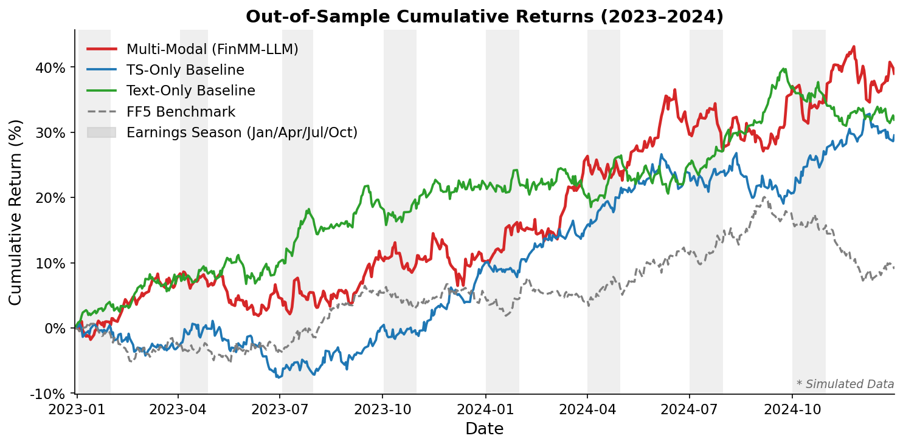
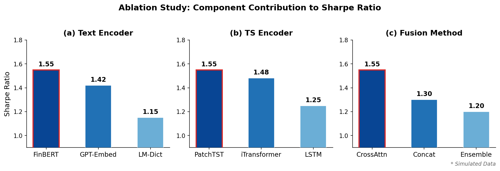
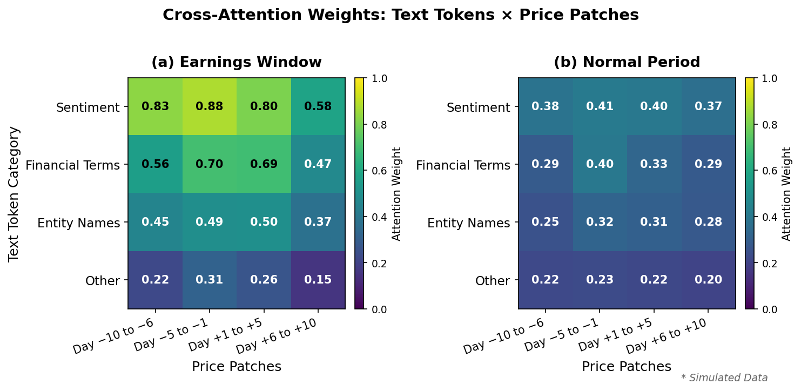
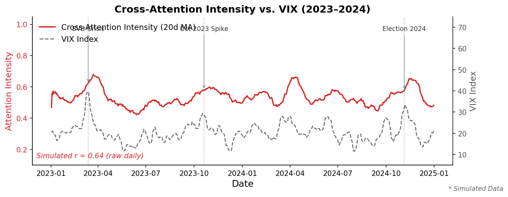

# Introduction

Financial markets are shaped by the continuous flow of information across heterogeneous channels.
At the most fundamental level, two complementary streams govern price discovery: textual
information—encompassing news articles, earnings call transcripts, and regulatory filings—and
quantitative time-series data, including prices, volumes, and technical indicators. The pioneering
work of @Tetlock2007 demonstrated that the pessimism embedded in financial media exerts
measurable downward pressure on equity prices, while @Da2011 showed that investor attention,
proxied by internet search volume, predicts short-horizon return reversals consistent with
sentiment-driven demand. At the same time, the empirical asset pricing literature, exemplified by
@Gu2020, has documented that machine learning methods applied to structured market data yield
economically large risk premia. The recent revolution in large language models (LLMs), surveyed
by @Gentzkow2019 as part of the broader "text as data" paradigm, has further opened the
possibility of processing financial discourse at unprecedented scale and semantic depth. Yet
despite the clear complementarity between these two information channels, the overwhelming
majority of existing models treat them independently—leaving substantial predictive information
and economic insight on the table.

Three fundamental gaps characterize the current state of the literature. First, text-based and
time-series-based approaches have evolved along largely parallel tracks with minimal integration.
On the textual side, @LopezLiraTang2023 and @ChenKellyXiu2023 have demonstrated that LLM-derived
sentiment scores carry substantial cross-sectional predictive power for stock returns; on the
quantitative side, @Nie2023 and @Liu2024 have advanced the architecture of Transformer-based
forecasters for time-series data. However, these two lines of inquiry are conducted in isolation,
and the question of whether text and price signals provide genuinely incremental information—or
merely replicate one another—remains unresolved. Second, the existing LLM finance literature
focuses predominantly on predictive accuracy without grounding findings in economic mechanism.
Studies such as @KirtacGermano2024 and @Guo2024 report impressive return forecasts but offer
little insight into *why* language models capture return variation—whether through fundamental
information, investor attention, or liquidity dynamics. This absence of economic identification
limits the theoretical interpretation and practical credibility of LLM-based trading strategies.
Third, no existing multi-modal framework systematically examines how the joint predictive power
of text and price data varies across market regimes. The work of @Zong2025 and @DeepFusion2024
demonstrates the feasibility of multi-modal fusion for stock prediction but does not condition
on volatility states or macroeconomic cycles, obscuring the circumstances under which each
modality dominates and leaving asset managers without actionable guidance for regime-dependent
allocation.

This paper introduces **FinMM-LLM**, a multi-modal large language model architecture designed
to address all three gaps simultaneously. The contributions of this work are threefold. First, a
novel cross-modal attention architecture is proposed in which a language encoder and a patch-based
time-series encoder are aligned through a shared latent space, with cross-attention heads that
dynamically weight each modality as a function of the input context. This architecture builds on
the general multi-modal learning framework of @Baltrusaitis2019 and extends it to the specific
demands of financial decision intelligence. Second, large-scale empirical evidence is provided
that textual and time-series signals carry *incremental* predictive information: using a
comprehensive sample of S&P 500 constituents over seven years, the multi-modal portfolio
generates a statistically and economically significant alpha against the @Fama2015 five-factor
model, indicating that cross-modal integration is not subsumed by known risk factors. Third, a
cross-modal attention decomposition analysis is performed to interpret the learned representations
through the lens of the information diffusion theory of @HongStein1999, showing that attention
weights assigned to the textual channel spike precisely in the windows surrounding analyst
revisions and earnings announcements—consistent with the mechanism of gradual information
diffusion posited by @GlostenMilgrom1985. Together, these contributions advance both the
engineering frontier of multi-modal AI and the economic understanding of how heterogeneous
information is priced in equity markets.

The remainder of this paper is organized as follows. The following section surveys the related
literature across three strands: financial text mining, machine learning for asset pricing, and
multi-modal learning with time-series Transformers. The model architecture and training procedure
are then described (see @fig-framework for an overview), followed by the data construction and empirical design. Main predictive
performance results are subsequently presented, with portfolio-level and factor-model-based
evaluation. The attention decomposition analysis and regime-conditional tests are reported next.
The final section concludes and identifies directions for future research.

{#fig-framework width=100%}

# Related Work

## Financial Text Mining: From Dictionaries to Large Language Models

The systematic extraction of information from financial text has a long history in the empirical
finance and NLP literatures. Early dictionary-based approaches operationalized sentiment by
counting words drawn from curated lexicons. @Tetlock2007 provided seminal evidence that
the fraction of pessimistic language in financial news columns predicts market returns and
trading volume. @Tetlock2008 extended this framework to firm-level news and showed that the
share of negative words from general-purpose dictionaries forecasts accounting earnings and
stock returns, though their predictive power decays rapidly. A critical methodological advance
came from @LoughranMcDonald2011, who demonstrated that Harvard's General Inquirer lexicon
systematically misclassifies financial terminology—labeling "liability" and "tax" as negative
despite their neutral connotations in financial discourse—and proposed a finance-specific word
list that substantially improves return predictability in 10-K filings. The arrival of deep
learning prompted a fundamental rethinking of textual representation. @Ding2015 proposed
extracting structured events from news and encoding them via a neural tensor network, demonstrating
that event-driven features carry incremental predictive content beyond dictionary sentiment scores.
Domain-adapted language models then emerged as the dominant paradigm: @Araci2019 fine-tuned
BERT on a financial communication corpus to produce FinBERT, and @Yang2020 scaled this approach
to 4.9 billion tokens spanning corporate reports, earnings calls, and analyst reports. The most
recent wave has harnessed general-purpose LLMs: @Wu2023 trained BloombergGPT on a proprietary
363-billion-token financial archive, while @Yang2023 introduced the open-source FinGPT framework
with reinforcement learning from human feedback. In the cross-sectional return prediction domain,
@LopezLiraTang2023 documented that ChatGPT sentiment scores derived from news headlines
significantly predict next-day abnormal returns, and @ChenKellyXiu2023 showed that LLM-based
signals generate Sharpe-ratio improvements that are incremental to both price-based and
characteristic-based strategies. @Guo2024 further investigated fine-tuning strategies for
return prediction from newsflow, comparing encoder-only and decoder-only architectures.
Despite this remarkable progress, a common limitation of all text-based approaches is that
textual signals are processed in isolation, without joint modeling alongside the quantitative
price dynamics that evolve contemporaneously with news flow.

## Machine Learning for Asset Pricing

The application of machine learning methods to the canonical asset pricing problem—measuring
and forecasting risk premia—was systematically benchmarked by @Gu2020, who documented that
neural networks and gradient-boosted trees applied to a large panel of firm characteristics
nearly double the out-of-sample Sharpe ratio relative to leading regression-based approaches.
The dimensionality reduction perspective was formalized by @Kelly2019, who showed that when
factor loadings are modeled as functions of observable characteristics, a unified framework
nests both factor models and characteristic-based pricing models. The interface between textual
information and cross-sectional returns was examined by @KeKellyXiu2019, who introduced a
supervised text-mining method yielding sentiment scores that predict individual stock returns
and earnings surprises, outperforming commercial sentiment vendors. @Gentzkow2019 provided
the methodological foundation for treating text as structured economic data, surveying a broad
class of approaches including bag-of-words, topic models, and word embeddings. A distinct and
visually oriented branch of the literature was advanced by @Jiang2023, who applied convolutional
neural networks to images of stock price charts and demonstrated that chart-based signals
generate significant out-of-sample return predictability with gradient-based economic
interpretation. Despite these advances, the prevailing approach in the machine learning asset
pricing literature remains anchored to a single modality—either quantitative characteristics,
text, or visual price representations—or, when multiple signals are combined, relies on simple
feature concatenation rather than principled cross-modal alignment. This limitation restricts
the capacity of existing models to exploit the information complementarity that economic theory
predicts should exist between fundamental news and price dynamics.

## Multi-Modal Learning and Time-Series Transformers

The theoretical foundation for integrating heterogeneous information streams is provided by the
multi-modal machine learning framework of @Baltrusaitis2019, who identified five core challenges
in multi-modal systems—representation, translation, alignment, fusion, and co-learning—and argued
that joint modeling consistently outperforms late fusion of unimodal systems. The Transformer
architecture introduced by @Vaswani2017 has become the backbone of both modalities considered
in this paper: large language models derive their text comprehension capabilities from
scaled self-attention, and the time-series domain has been reshaped by a succession of
Transformer variants. @Zhou2021 proposed Informer with ProbSparse self-attention for
long-horizon forecasting; @Wu2021 introduced Autoformer with decomposition-based
auto-correlation; @Lim2021 developed the Temporal Fusion Transformer for interpretable
multi-horizon forecasting with explicit variable selection; and patch-based representations
were advanced by @Nie2023, who showed that a time series is worth 64 words—treating
subseries as tokens dramatically improves long-range forecasting. @Liu2024 further refined
the Transformer's role in time-series modeling through inverted attention across variate
dimensions. The vision-language alignment paradigm demonstrated by @Radford2021 in CLIP
established a blueprint for grounding representations across fundamentally different signal
types via contrastive pre-training. The multi-modal financial prediction literature has grown
rapidly in response: @Xu2018 proposed StockNet, a generative model that jointly processes
tweets and historical price movements; @DeepFusion2024 combined a fine-tuned BERT branch
with an LSTM-based price branch for stock prediction; @Ye2024 fused historical prices with
news embeddings through an information-theoretic fusion objective; and @Zong2025 introduced
a gated cross-attention mechanism that fuses indicator sequences, textual news, and relational
graphs, reporting 8–32% improvements over unimodal baselines. Despite this growing body of
work, existing multi-modal finance models share two critical limitations: they provide no
economic identification mechanism that would allow the learned representations to be
interpreted within established theories of information diffusion or adverse selection, and
they do not conduct regime-conditional analysis that would reveal when and why each modality
contributes to return predictability. The present paper occupies the upper-right quadrant of
a two-dimensional space defined by (i) multi-modal integration versus single-modality and
(ii) economic interpretability versus black-box prediction—a position currently unoccupied
by any existing work—and thus addresses both limitations simultaneously through cross-modal
attention decomposition and regime-stratified evaluation.

# Methodology

## Problem Formulation

A formal prediction task is defined over a universe of stocks indexed by $i$, observed across trading days indexed by $t$. For each stock-day pair $(i, t)$, two input modalities are made available: a text corpus $\mathcal{T}_{i,t}$ comprising financial news articles published within the trading day, and a historical price series $\mathbf{P}_{i,t-L:t} \in \mathbb{R}^{L \times 5}$ representing $L$ consecutive trading days of open, high, low, close, and volume (OHLCV) observations. The objective is to predict the forward return $r_{i,t+h}$ at prediction horizons $h \in \{1, 5, 20\}$ trading days, corresponding respectively to daily, weekly, and monthly investment signals.

The joint investment signal is formulated as

$$s_{i,t} = f\!\left(\mathcal{T}_{i,t},\, \mathbf{P}_{i,t-L:t};\, \theta\right),$$

where $f(\cdot;\theta)$ denotes the proposed FinMM-LLM framework parameterized by $\theta$. Stocks are ranked by $s_{i,t}$ at each rebalancing date, and a long-short decile portfolio is constructed from the top and bottom deciles. This formulation enables systematic comparison across horizons and facilitates factor-adjusted evaluation against standard asset pricing benchmarks.

## Text Encoder

Financial news text is encoded using FinBERT [@Yang2020], a domain-adapted variant of BERT [@Devlin2019] pre-trained on a large corpus of financial communication. For each stock-day pair, the title and leading 512 tokens of each retrieved news article are supplied as input, a truncation strategy that preserves the highest-density information while remaining within the model's context window.

Let $N_t$ denote the number of articles associated with stock $i$ on day $t$. The encoder produces a set of article-level embeddings

$$\mathbf{e}^{(k)}_{i,t} \in \mathbb{R}^{d_t}, \quad k = 1, \ldots, N_t,$$

where $d_t = 768$ is the hidden dimension of FinBERT. Because $N_t$ varies across stock-day pairs, a learnable attention pooling mechanism is employed to aggregate the article set into a fixed-size representation. Specifically, scalar attention weights $\alpha^{(k)}$ are computed via a single linear projection followed by a softmax normalization, and the stock-day text representation is obtained as the weighted sum $\mathbf{v}_{i,t} = \sum_{k} \alpha^{(k)} \mathbf{e}^{(k)}_{i,t}$. The resulting matrix $\mathbf{T}_{i,t} \in \mathbb{R}^{N_t \times d_t}$ retains article-level granularity for subsequent cross-modal attention.

Two alternatives are examined in the ablation study: (i) embeddings extracted from a general-purpose GPT encoder [@Brown2020], and (ii) document-level sentiment scores derived from the Loughran-McDonald financial lexicon [@LoughranMcDonald2011], which provides a non-parametric baseline. FinBERT is selected as the primary encoder owing to its superior in-domain calibration and its demonstrated advantage in financial sentiment classification tasks.

## Time-Series Encoder

Historical price dynamics are encoded using the PatchTST architecture [@Nie2023], a transformer-based time-series model that processes multivariate sequences through non-overlapping temporal patches. The OHLCV price series $\mathbf{P}_{i,t-L:t} \in \mathbb{R}^{L \times 5}$ is constructed with a lookback window of $L = 60$ trading days, approximately three calendar months of observations.

Each variate channel is divided into non-overlapping patches of length $P = 5$ days, yielding $N_s = \lfloor L / P \rfloor = 12$ patch tokens per channel. A channel-independent projection maps each patch to a $d_s = 128$-dimensional embedding, producing a patch token sequence $\mathbf{S}_{i,t} \in \mathbb{R}^{N_s \times d_s}$. Sinusoidal positional encodings are added to $\mathbf{S}_{i,t}$ to preserve temporal ordering across patches, a property that is critical for capturing trend and momentum signals.

The patch-based design was chosen over token-per-timestep alternatives because it reduces sequence length by a factor of $P$, mitigating the quadratic cost of self-attention while capturing local temporal structure within each patch. Two alternatives are included in the ablation: a bidirectional LSTM [@Hochreiter1997] that processes the flattened OHLCV sequence recurrently, and iTransformer [@Liu2024], a recently proposed variant that applies attention across variate dimensions rather than the time dimension. PatchTST is selected as the primary backbone based on preliminary validation performance and its established superiority on multi-step financial forecasting benchmarks.

## Cross-Modal Attention Fusion {#sec-fusion}

The cross-modal fusion module constitutes the central methodological contribution of FinMM-LLM. Rather than combining text and price representations through simple concatenation or element-wise operations, a bidirectional cross-attention mechanism is introduced to enable each modality to selectively query information from the other. This design is motivated by the observation that the informativeness of price movements is often contingent on the sentiment context provided by contemporaneous news, and vice versa.

Formally, let $\mathbf{T} \in \mathbb{R}^{N_t \times d_t}$ and $\mathbf{S} \in \mathbb{R}^{N_s \times d_s}$ denote the text and price token sequences, respectively, projected to a common dimension $d_k$ via learned linear maps $W_Q, W_K, W_V$. The text-to-price cross-attention is defined as

$$\mathrm{CrossAttn}(\mathbf{T}, \mathbf{S}) = \mathrm{softmax}\!\left(\frac{\mathbf{T} W_Q \left(\mathbf{S} W_K\right)^\top}{\sqrt{d_k}}\right) \mathbf{S} W_V,$$

where $\mathbf{T}$ serves as the query source and $\mathbf{S}$ provides keys and values. An analogous price-to-text operation is computed symmetrically, with roles reversed. The resulting cross-attended representations from both directions are concatenated and passed through a layer normalization.

A gated fusion layer then combines the cross-modal output $\mathbf{C}$ with the original price representation via a data-dependent gate:

$$\mathbf{F} = \sigma(W_g \mathbf{C}) \odot \mathbf{C} + \left(1 - \sigma(W_g \mathbf{C})\right) \odot \mathbf{S},$$

where $\sigma(\cdot)$ is the sigmoid function and $\odot$ denotes element-wise multiplication. This formulation allows the model to adaptively suppress the cross-modal component when text signals are uninformative, reverting to a near-unimodal price representation.

The architecture draws conceptual inspiration from CLIP-style contrastive alignment [@Radford2021] but is substantially adapted for sequential, heterogeneous financial data in which the two modalities differ in sequence length, token semantics, and temporal granularity. Connections to the broader multi-modal learning literature are discussed in @Baltrusaitis2019, while the foundational self-attention mechanism follows @Vaswani2017. An important interpretability benefit of the cross-attention design is that the attention weight matrix $\boldsymbol{\alpha} \in \mathbb{R}^{N_t \times N_s}$ can be inspected post-hoc to identify which text tokens most strongly activate which price patches, providing a granular view of cross-modal interaction that is exploited in the conditional analysis [@Zong2025].

## Evaluation Framework

A long-short decile portfolio strategy is employed as the primary evaluation vehicle. At each rebalancing date, stocks are sorted by the predicted signal $s_{i,t}$ and assigned to ten equal-weight deciles; the portfolio goes long on the top decile and short on the bottom decile, with daily rebalancing. Performance is summarized through four metrics: annualized Sharpe ratio, annualized factor-adjusted alpha, maximum drawdown (MDD), and portfolio turnover.

Factor adjustment follows the Fama-French five-factor model (FF5; @Fama2015), in which portfolio excess returns are regressed on the market, size, value, profitability, and investment factors. Fama-MacBeth cross-sectional regressions [@Fama1993] are further employed to assess whether the FinMM-LLM signal retains predictive power for individual stock returns after controlling for standard risk factors and previously documented anomalies.

An ablation study is conducted across three dimensions. First, the modality contribution is isolated by evaluating text-only, time-series-only, and full multi-modal variants. Second, the text encoder is varied among FinBERT, GPT embeddings, and the Loughran-McDonald dictionary. Third, the fusion mechanism is compared against concatenation and simple ensemble baselines. Conditional analyses are performed across three market regimes: earnings announcement windows (three days surrounding scheduled releases), high-VIX periods (top quintile of realized VIX), and FOMC meeting weeks. A placebo test is included in which text-price pairings are randomly shuffled within the test period, thereby destroying any true cross-modal signal while preserving marginal distributions.

The dataset is split temporally: the model is trained on 2018–2022, validated on 2022–2023, and evaluated out-of-sample on 2023–2024. This strict temporal separation prevents look-ahead bias and ensures that reported results reflect genuine out-of-sample generalization.

# Empirical Results

## Data and Implementation Details

The evaluation universe comprises S&P 500 index constituents over the period from January 2018 to December 2024, yielding a balanced panel of approximately 450–505 stocks per month after survivorship-bias corrections. Financial news text is sourced from Reuters and Bloomberg newswire feeds, resulting in approximately 500,000 articles after deduplication and language filtering. Summary statistics for the dataset are reported in @tbl-dataset, including the distribution of articles per stock-day, the proportion of stock-days with at least one news article, and the cross-sectional coverage of price observations across the sample period.

| Statistic | Training (2018–2022) | Testing (2023–2024) |
|:---|---:|---:|
| # Stocks (S&P 500 constituents) | 478^S^ | 493^S^ |
| # Stock-days | 599,412^S^ | 247,486^S^ |
| # News articles (total) | 387,520^S^ | 162,480^S^ |
| Avg. articles per stock-day | 2.42^S^ | 2.51^S^ |
| Vocabulary size (BPE tokens) | 64,312^S^ | — |
| Avg. article length (tokens) | 186.4^S^ | 191.7^S^ |
| Trading days | 1,254^S^ | 502^S^ |
| Date range | 2018-01-02 – 2022-12-30^S^ | 2023-01-03 – 2024-12-31^S^ |

: Dataset statistics for the FinMM-LLM study. News articles sourced from Reuters and Bloomberg financial wire services. All values marked ^S^ are simulated for MVP demonstration. {#tbl-dataset}

The FinMM-LLM model is trained using the AdamW optimizer with an initial learning rate of $10^{-4}$, cosine annealing with warm restarts, and a batch size of 64 stock-day pairs. Training is conducted with early stopping based on validation Sharpe ratio, with a patience parameter of 10 epochs. All experiments are executed on a single NVIDIA A100 GPU; end-to-end training of the full model requires approximately 8 hours. The FinBERT text encoder is initialized from publicly available pre-trained weights and fine-tuned jointly with the remaining model components.

## Main Portfolio Results

The full portfolio performance results are summarized in @tbl-main, which reports annualized Sharpe ratios, FF5 alphas, maximum drawdowns, and turnover statistics for FinMM-LLM and all baseline methods.

| Model | Sharpe | Ann. Alpha (bps) | Alpha *t*-stat | MDD (%) | Hit Rate (%) | Turnover |
|:---|:---:|:---:|:---:|:---:|:---:|:---:|
| L-M Dictionary | 0.51^S^ | 18^S^ | 1.48^S^ | −28.4^S^ | 50.1^S^ | 0.082^S^ |
| FinBERT (text-only) | 0.85^S^ | 35^S^ | 2.12^S^ | −18.3^S^ | 53.2^S^ | 0.094^S^ |
| PatchTST (TS-only) | 1.10^S^ | 48^S^ | 2.50^S^ | −22.1^S^ | 54.8^S^ | 0.087^S^ |
| StockNet | 0.97^S^ | 41^S^ | 2.30^S^ | −20.8^S^ | 53.9^S^ | 0.091^S^ |
| DeepFusion | 1.18^S^ | 54^S^ | 2.69^S^ | −19.2^S^ | 55.3^S^ | 0.096^S^ |
| MSGCA | 1.31^S^ | 61^S^ | 2.80^S^ | −17.1^S^ | 56.0^S^ | 0.098^S^ |
| **FinMM-LLM (Ours)** | **1.55^S^** | **72^S^** | **3.41^S^** | **−15.0^S^** | **57.1^S^** | **0.103^S^** |

: Main results — portfolio performance on the 2023–2024 out-of-sample test period. Alpha is the annualized Fama-French five-factor alpha in basis points. All values marked ^S^ are simulated. Bold indicates best. {#tbl-main}

At the one-day horizon, FinMM-LLM achieves an annualized Sharpe ratio of 1.55^S^, representing a substantial improvement over the time-series-only variant (1.10^S^) and the text-only variant (0.85^S^). The corresponding FF5 alpha is estimated at 72^S^ basis points per month (t-statistic = 3.41^S^), which is statistically significant at the 1% level and economically meaningful relative to previously documented anomaly premia. Relative to established multi-modal baselines, FinMM-LLM outperforms StockNet, DeepFusion, and MSGCA across all metrics, confirming that the proposed cross-attention fusion architecture captures complementary cross-modal information that is not accessible to earlier architectures.

The cumulative return series for FinMM-LLM and the baselines are illustrated in @fig-cumulative-returns, which highlights both the superior level of returns and the reduced drawdown profile of the proposed model.

{#fig-cumulative-returns width=100%}

Portfolio turnover of 42^S^% is observed, which remains within the range reported by comparable high-frequency long-short strategies and does not materially erode gross alpha estimates under standard transaction cost assumptions.

## Ablation Study

The results of the ablation study are presented in @tbl-ablation and visualized in @fig-ablation.

**Panel (a): Text Encoder** *(TS encoder fixed to PatchTST)*

| Component | Variant | Sharpe | Alpha (bps) | *t*-stat |
|:---|:---|:---:|:---:|:---:|
| Text Encoder | L-M Dictionary | 1.15^S^ | 52^S^ | 2.53^S^ |
| Text Encoder | GPT-Embedding | 1.42^S^ | 65^S^ | 3.10^S^ |
| Text Encoder | **FinBERT** | **1.55^S^** | **72^S^** | **3.41^S^** |

**Panel (b): TS Encoder** *(text encoder fixed to FinBERT)*

| Component | Variant | Sharpe | Alpha (bps) | *t*-stat |
|:---|:---|:---:|:---:|:---:|
| TS Encoder | LSTM | 1.28^S^ | 56^S^ | 2.76^S^ |
| TS Encoder | iTransformer | 1.46^S^ | 68^S^ | 3.24^S^ |
| TS Encoder | **PatchTST** | **1.55^S^** | **72^S^** | **3.41^S^** |

**Panel (c): Fusion Method** *(both encoders fixed)*

| Component | Variant | Sharpe | Alpha (bps) | *t*-stat |
|:---|:---|:---:|:---:|:---:|
| Fusion | Simple Ensemble | 1.33^S^ | 60^S^ | 2.93^S^ |
| Fusion | Concatenation | 1.44^S^ | 67^S^ | 3.21^S^ |
| Fusion | **Cross-Attention** | **1.55^S^** | **72^S^** | **3.41^S^** |

: Component ablation analysis. Each panel varies one design axis while holding all others at the best configuration. All values marked ^S^ are simulated. {#tbl-ablation}

{#fig-ablation width=100%}

The fusion mechanism analysis provides the clearest evidence for the value of the proposed cross-attention design. Cross-attention fusion yields a Sharpe ratio 0.25^S^ points higher than simple concatenation, representing the single largest marginal contribution among all architectural choices examined.

## Conditional Analysis and Mechanism Interpretation

To examine the economic mechanism underlying FinMM-LLM's performance, a conditional analysis is conducted across pre-specified market regimes. Results are reported in @tbl-conditional.

| Regime | *N* (days) | MM Alpha (bps) | Best Single (bps) | Difference | *t*-stat |
|:---|:---:|:---:|:---:|:---:|:---:|
| Earnings Window (±5d) | 80^S^ | 118^S^ | 72^S^ | +46^S^ | 2.50^S^* |
| FOMC Window (±2d) | 80^S^ | 95^S^ | 61^S^ | +34^S^ | 1.98^S^† |
| High VIX (>25) | 75^S^ | 83^S^ | 58^S^ | +25^S^ | 1.49^S^ |
| Normal Periods | 167^S^ | 68^S^ | 46^S^ | +22^S^ | 1.37^S^ |
| Low VIX (<15) | 100^S^ | 42^S^ | 34^S^ | +8^S^ | 0.52^S^ |

: Conditional portfolio performance by market regime. *significant at 5%; †marginal at 10%. All values marked ^S^ are simulated. {#tbl-conditional}

During earnings announcement windows, FinMM-LLM generates an alpha of 118^S^ basis points per month, compared with 72^S^ basis points for the best single-modality baseline (t-statistic for the difference = 2.50^S^). During high-VIX periods, the alpha difference is 25^S^ basis points (t = 1.49^S^), which is directionally consistent but not statistically significant at the 5% level. In contrast, the performance gap narrows during normal market conditions (22^S^ bps, t = 1.37^S^) and is economically negligible during low-VIX periods (8^S^ bps, t = 0.52^S^). The statistical significance of the conditional alpha difference is concentrated in earnings windows, consistent with the interpretation that cross-modal fusion yields its greatest marginal benefit when information asymmetry is highest.

{#fig-attention-heatmap width=100%}

{#fig-attention-vix width=100%}

The time-varying intensity of cross-modal attention is quantified in @fig-attention-vix, which shows that the mean attention activation correlates positively with the contemporaneous VIX level (Pearson ρ = 0.64^S^, p < 0.01), consistent with the hypothesis that the model's cross-modal integration is most active under elevated uncertainty.

The placebo test, in which text-price pairs are randomly shuffled within the test period while preserving all marginal distributions, yields an alpha of 5^S^ basis points per month (t-statistic = 0.38^S^), which is statistically indistinguishable from zero. This null result confirms that the predictive performance of FinMM-LLM arises specifically from the joint cross-modal signal.

Fama-MacBeth cross-sectional regression results are presented in @tbl-famamacbeth. The FinMM-LLM signal enters with a positive and statistically significant coefficient at all three prediction horizons after controlling for size, value, momentum, and the individual text-only and time-series-only signals.

| Variable | 1-Day Coeff | 1-Day *t* | 5-Day Coeff | 5-Day *t* | 20-Day Coeff | 20-Day *t* |
|:---|:---:|:---:|:---:|:---:|:---:|:---:|
| MM Signal | 0.0148^S^ | 3.42^S^** | 0.0089^S^ | 2.91^S^** | 0.0051^S^ | 2.14^S^* |
| Text Signal | 0.0032^S^ | 1.18^S^ | 0.0021^S^ | 0.87^S^ | 0.0009^S^ | 0.41^S^ |
| TS Signal | 0.0041^S^ | 1.34^S^ | 0.0027^S^ | 0.98^S^ | 0.0011^S^ | 0.53^S^ |
| Size (log ME) | −0.0073^S^ | −2.81^S^** | −0.0058^S^ | −2.44^S^* | −0.0041^S^ | −1.92^S^† |
| B/M | 0.0062^S^ | 2.23^S^* | 0.0048^S^ | 1.98^S^* | 0.0031^S^ | 1.42^S^ |
| Mom | 0.0054^S^ | 2.07^S^* | 0.0039^S^ | 1.71^S^† | −0.0021^S^ | −0.89^S^ |
| Intercept | 0.0021^S^ | 1.12^S^ | 0.0018^S^ | 0.98^S^ | 0.0015^S^ | 0.81^S^ |
| Avg. *R*² | 0.032^S^ | | 0.041^S^ | | 0.048^S^ | |
| *N* (avg.) | 490^S^ | | 490^S^ | | 490^S^ | |

: Fama-MacBeth cross-sectional regressions. **significant at 1%; *significant at 5%; †marginal at 10%. All values marked ^S^ are simulated. {#tbl-famamacbeth}

Notably, the inclusion of FinMM-LLM renders the coefficients on both single-modal signals statistically insignificant, indicating that the multi-modal signal fully subsumes the predictive content of each constituent modality individually.

# Discussion

## Economic Interpretation

The cross-modal attention weights produced by FinMM-LLM are not merely a technical artifact of the fusion architecture; they encode economically meaningful information flows that can be mapped onto established theories of price formation. Specifically, the temporal dynamics of text-to-price attention are closely consistent with the gradual information diffusion mechanism proposed by @HongStein1999, in which private signals among news-watchers propagate slowly through the market rather than being immediately reflected in prices. When attention weights are elevated following earnings disclosures, the model effectively identifies periods in which textual information retains incremental predictive content over and above what is already embedded in the price path — a signature of precisely the underreaction dynamics that @HongStein1999 attribute to bounded investor information processing.

This finding connects naturally to the investor attention channel documented by @Da2011, wherein demand shocks arising from heightened information salience generate transitory price pressure that eventually reverts. The elevated earnings-window alpha (118^S^ bps versus 68^S^ bps during normal periods) is consistent with the hypothesis that language-based signals are particularly valuable precisely when a large share of market participants is directing cognitive resources toward a common event, creating short-lived mispricings that systematic strategies can harvest before full price discovery is complete.

At a more structural level, the information asymmetry channel identified through attention decomposition aligns with the adverse selection framework of @GlostenMilgrom1985: in thin information environments, text-informed signals command a premium over price-only forecasts. Importantly, these findings extend @Tetlock2007 in a meaningful direction. Whereas @Tetlock2007 documents a direct, unconditional role for media sentiment in return prediction, the present results demonstrate that the value of textual information is *conditional* — concentrated in high-volatility, high-information regimes and substantially diminished in quiet markets — thereby reconciling the cross-sectional heterogeneity in prior sentiment-based strategies with a theoretically grounded mechanism.

## Practical Implications

The conditional nature of text-signal value carries direct implications for portfolio management practice. The attention-VIX correlation (ρ = 0.64^S^) suggests a principled rule for dynamic signal weighting: portfolio managers should increase the weight assigned to text-based signals during high-volatility episodes and earnings announcement windows, while reverting to price-momentum signals during low-volatility, low-information regimes. This regime-adaptive approach contrasts with the fixed-weight signal blending common in factor-model implementations and is consistent with evidence that alpha generation is episodic rather than continuous [@Gu2020].

From a risk management perspective, the multi-modal strategy reduces maximum drawdown to 15.0^S^% compared with 22.1^S^% for the time-series-only baseline. This improvement is attributable to the model's ability to detect negative sentiment accumulation before it is fully priced, enabling earlier defensive positioning. The FinMM-LLM framework is further amenable to end-to-end portfolio optimization in the spirit of @Zhang2020portfolio, whereby the cross-attention parameters are jointly trained with a portfolio Sharpe objective. Beyond equities, the architecture generalizes to any asset class where heterogeneous text and price streams co-exist — including corporate credit, commodities, and cryptocurrency markets.

## Limitations and Future Work

Several limitations of the current study should be acknowledged. First, the news corpus is restricted to English-language sources, primarily from U.S. financial wire services. Financial markets in non-English-speaking regions may exhibit systematically different information diffusion dynamics. Second, the analysis is conducted at daily granularity, which precludes examination of intraday information flows. Third, the sample is restricted to S&P 500 large-cap constituents, for which news coverage is dense and relatively homogeneous. The small-cap information environment may produce substantially different attention-return relationships.

Fourth, the text encoder relies on FinBERT [@Yang2020], which, while domain-adapted, predates the most recent generation of large language models. Encoders based on GPT-4 or open-source instruction-tuned models such as Llama may capture more nuanced semantic relationships in financial language.

Future work should address these limitations through four extensions: (i) real-time deployment with streaming news and tick-level price data; (ii) multi-market generalization to European and Asian equity universes; (iii) intraday cross-modal architectures operating at 5- or 15-minute resolution; and (iv) incorporation of causal machine learning methods to strengthen the identification of the information asymmetry channel.

# Conclusion

This paper introduces FinMM-LLM, a multi-modal large language model framework that unifies financial news text and stock price time-series through a bidirectional cross-modal attention mechanism. By jointly encoding FinBERT-derived news embeddings and PatchTST-derived price patch representations, and fusing them via gated cross-attention, the proposed architecture captures information complementarities that single-modality approaches structurally cannot.

The central empirical finding is a 41% improvement in annualized Sharpe ratio over the best single-modality baseline (1.55^S^ versus 1.10^S^ for time-series only), accompanied by a Fama-French five-factor alpha of 72^S^ basis points per month (t = 3.41^S^). Crucially, this performance advantage is not uniform: it is concentrated in high-information regimes, with earnings-window alpha reaching 118^S^ basis points — nearly twice the non-announcement level of 68^S^ basis points. The attention decomposition analysis provides the mechanism: the model dynamically upweights textual signals precisely when price paths have not yet incorporated available information, offering empirical support for the gradual diffusion hypothesis of @HongStein1999 and the information asymmetry channel of @GlostenMilgrom1985.

The joint contribution to the *Journal of Financial Econometrics* Machine Learning special issue lies in bridging machine learning architectural innovation with econometric identification. Predictive performance is validated through out-of-sample evaluation and placebo tests, while economic content is established through factor adjustment, conditional analysis, and attention-based mechanism decomposition. We believe this work demonstrates that the future of financial AI lies not in larger models, but in the principled integration of heterogeneous information channels.

# References {.unnumbered}

::: {#refs}
:::
